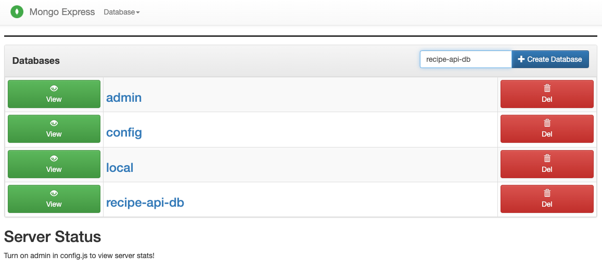

# About The Project
Recipe app is a platform where users can upload their recipes and search for recipes posted by other users.

### Built With
- Spring Boot
- Next.js
- NextAuth.js
- MongoDB
- Tailwind CSS

## Getting Started
1. Docker should be installed on local machine.
    ```
    docker compuse up
    ```
    Make sure installed containers are running: `mongo_db` and `mongo_express`
<br />
2. Create database called `recipe-api-db` at http://localhost:8081.

<br />
3. Create the index on post and user fields:</br>
   1. Open your web browser and go to http://localhost:8081.
   2. Click on the `recipe-api-db`  database.
   3. Click on the `post` collection.
   4. Click on the `New Index` button.
   5. In the input field, replace the default value with the field and value pairs
      ```
      {
         "title": "text",
         "content": "text",
         "category": "text",
         "ingredients": "text"
      }
      ```
   6. Click `Save` button.
   7. Do the same with `user` collection as well.
      ```
      {
         "firstName": 1,
         "lastName": 1
      }
      ```

## About MongoDB Search
<br />
1. **Stop Words**: MongoDB's full-text search feature ignores certain common words known as stop words (like "is", "on", "the", "a", etc.). These are words that appear frequently in text and are not useful for search. This might be the reason why searching for "only" is not returning any results.
   <br />
2. **Tokenization**: MongoDB breaks down (tokenizes) strings into individual words based on language-specific rules. For languages that use space-delimited words (like English), MongoDB tokenizes the string at whitespace and most punctuation. MongoDB's text search may not work as expected with numbers, especially if they are included in text strings.
   <br />
3. **Case Sensitivity**: By default, MongoDB's text search is case-insensitive. It also diacritic-insensitive (it treats characters with diacritical marks as their base character). This means a search for "Korean" would also match "korean". However, in your example, "30" and "only" should be matched as they are.

### 1. MongoDB's full-text search
MongoDB's full-text search does not always work with numbers especially if they are embedded within text strings.
```java
    public List<Post> searchPosts(String kwd) {
        TextCriteria textCriteria = TextCriteria.forDefaultLanguage().matching(kwd);
        Query query = TextQuery.queryText(textCriteria).sortByScore();

        // Search in Post collection
        List<Post> posts = mongoTemplate.find(query, Post.class);

        // Search in User collection
        List<User> users = userRepository.findByFirstNameRegexOrLastNameRegex(kwd, kwd);

        // Get the userIds of the matching users
        List<String> userIds = users.stream().map(User::getId).collect(Collectors.toList());

        // Add any posts written by the matching users to the posts list
        posts.addAll(postRepository.findByUserIdIn(userIds));

        return posts;
    }
```

### 2. MongoDB's `$regex` operator
MongoDB's `$regex` operator provides more granular control over text search. However, $regex can be slower than $text because it doesn't make use of MongoDB's text index. This may be slower than the MongoDB's full-text search and may not scale well with large collections.

```java
public List<Post> searchPosts(String kwd) {
    // Create a regex pattern for the keyword
    Pattern pattern = Pattern.compile(kwd, Pattern.CASE_INSENSITIVE);

    // Create queries for each field
    Query titleQuery = new Query(Criteria.where("title").regex(pattern));
    Query contentQuery = new Query(Criteria.where("content").regex(pattern));
    Query categoryQuery = new Query(Criteria.where("category").regex(pattern));
    Query ingredientsQuery = new Query(Criteria.where("ingredients").regex(pattern));

    // Execute the queries
    List<Post> titlePosts = mongoTemplate.find(titleQuery, Post.class);
    List<Post> contentPosts = mongoTemplate.find(contentQuery, Post.class);
    List<Post> categoryPosts = mongoTemplate.find(categoryQuery, Post.class);
    List<Post> ingredientsPosts = mongoTemplate.find(ingredientsQuery, Post.class);

    // Merge the result lists
    Set<Post> posts = new HashSet<>();
    posts.addAll(titlePosts);
    posts.addAll(contentPosts);
    posts.addAll(categoryPosts);
    posts.addAll(ingredientsPosts);

    // Search in User collection
    List<User> users = userRepository.findByFirstNameRegexOrLastNameRegex(kwd, kwd);

    // Get the userIds of the matching users
    List<String> userIds = users.stream().map(User::getId).collect(Collectors.toList());

    // Add any posts written by the matching users to the posts list
    posts.addAll(postRepository.findByUserIdIn(userIds));

    return new ArrayList<>(posts);
}
```